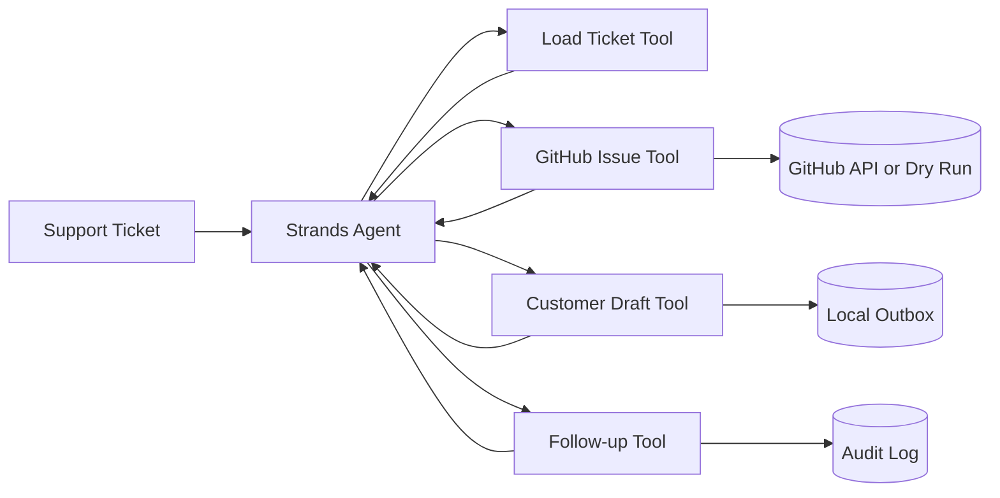

# MaintainerMate

MaintainerMate is a Strands Agents TypeScript project for small software teams. It converts incoming support/maintenance tickets into auditable operational work instead of stopping at chat.

## What it does

1. Loads a ticket from the inbox.
2. Calculates urgency and lets the Strands agent reason over the incident.
3. Creates a focused GitHub engineering issue when credentials are available, otherwise emits an explicit dry-run preview.
4. Writes a customer-response draft without auto-sending.
5. Records a follow-up action with a due time.
6. Returns an audit summary distinguishing live actions from dry runs.

The design intentionally separates autonomous execution from risky external actions. It never claims an action succeeded unless the tool confirms it.

## Run locally

Requirements: Node.js 22+.

```bash
cd projects/maintainermate
npm install
npm test
npm run dev -- T-1001
```

By default Strands uses Amazon Bedrock. Configure AWS credentials or a Bedrock API key as documented by Strands Agents.

Optional live GitHub issue creation:

```bash
export GITHUB_TOKEN=...
export GITHUB_REPOSITORY=owner/repo
npm run dev -- T-1001
```

Without those variables, the GitHub tool is safely dry-run only.

## Why it matters

Small engineering teams repeatedly lose time translating customer incidents into internal issues, customer updates and follow-up reminders. MaintainerMate closes that loop with one agent while keeping every side effect auditable.

## Architecture



## Reliability choices

- Deterministic urgency scoring is tested separately from LLM reasoning.
- External GitHub mutation requires explicit environment credentials.
- Email/customer communication remains draft-only.
- The system prompt prohibits fabricated success claims and secret handling.
- The final response must enumerate live versus dry-run actions.

## Hackathon fit

Built for the AWS Agents for Humans Hackathon during the submission period, targeting the **Professional Agents** track. It uses the Strands Agents SDK as the orchestration layer and demonstrates a complete workflow for maintainers and small software teams.

## License

MIT.
